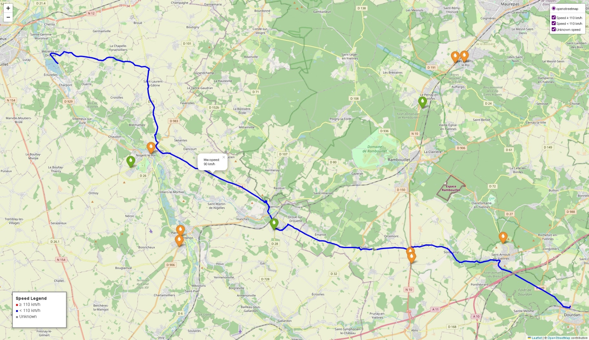

# gpx-speed-map 🗺️

gpx-speed-map is a lightweight Python project that analyzes GPX files to extract maximum speed limits along a route using OpenStreetMap data via the Overpass API, and visualizes the results on an interactive map.

In addition to speed data, the map also displays nearby fuel stations that offer _SP95_ and/or _SP98_.




## 🏍️ Why this project?

This tool is especially useful for:

- 125cc motorcycle riders who should avoid high-speed roads like expressways or highways limited to 110 km/h or more

- Planning safer, legal, and optimized routes by identifying sections with speed limits and nearby fuel availability

By visualizing speed limits on your GPX track, you can:

- Identify roads with high-speed limits (e.g., ≥ 110 km/h)

- Adjust your itinerary before riding for safety and legality

- Spot nearby stations selling SP95/SP98 fuel

## ⚙️ Installation

Make sure you have Python 3.7 or higher installed.

1. Clone the repository

```sh
git clone https://github.com/your-username/gpx-speed-map.git

cd gpx-speed-map
```

2. Install dependencies

```sh
pip install -r requirements.txt
```

## 🧪 Usage

Run the script with your GPX file path as argument

```sh
python plot_speed_map.py --file data/input.gpx

# or...

python plot_speed_map.py --file data/input.gpx --limit-speed 90 --max-points 300
```

The script will:

- Parse your GPX file

- Query max speed limits for sampled points along the route

- Generate an interactive map saved as `speed_map.html` in the current directory

Open `speed_map.html` in your browser to explore the route and speed limit markers.

## ⚠️ Notes

- Speed limit markers are color-coded:

   - 🔴 Red: speed limit ≥ 110 km/h

   - 🔵 Blue: speed limit below 110 km/h

   - ⚪ Gray: speed limit unknown

- Fuel station markers show availability:

   - ✅ SP95 / SP98 availability indicated in popup

   - 🟢 Green icon if both are available

   - 🟠 Orange icon if only one is available

- The script respects Overpass API usage guidelines by limiting queries to 500 sampled points and adding delays.
